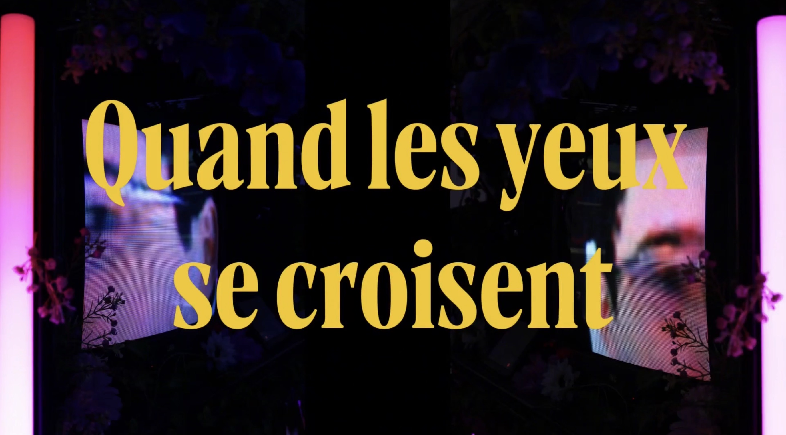

# Dossier de presse

## Fiche d’informations

### Développeur :

[Programme de Techniques d'intégration multimédia du Collège Montmorency](https://tim-montmorency.com/)

### Date de présentation :

Du 16 au 20 mars 2026.

### Forme :

Installation contemplative et interactive

### Site Web du projet :

[Quand les yeux se croisent](https://emersiaa.github.io/Quand-les-yeux-se-croisent/#/)

### Site Web de l'exposition collective :

[Réseau vivant](https://tim-montmorency.com/2026/#/)

### Prix :

Gratuit

---

### Description

**Quand les yeux se croisent** est une installation immersive composée d’une collection de regards humains et animaux diffusés sur quatre télévisions cathodiques rétro disposées en structure rectangulaire au centre d’un grand studio. Le visiteur peut se déplacer librement autour de l’installation, découvrant progressivement ces écrans vintages qui forment une mosaïque de regards projetés en boucle. Deux caméras captent sa présence et enregistrent son propre regard, l’intégrant subtilement à l’œuvre et l’ajoutant à cette collection vivante. Cette interaction influence également l’intensité des barres LED entourant la structure ainsi que l’ambiance sonore, rendant l’expérience évolutive et sensible à chaque présence. En circulant autour des télévisions, le visiteur comprend qu’il ne fait pas seulement face aux images, mais qu’il en fait partie, créant un dialogue visuel entre humains et animaux qui révèle le lien profond et universel unissant tous les êtres vivants ; les fleurs représentent la sensibilité au cœur du projet et renforcent notre esthétique de rêve éveillé, apportant douceur et poésie à cette expérience contemplative suspendue entre mémoire et imaginaire.

### Histoire

---

Cette installation est née d’une idée originale imaginée par Patricia Nassif, portée par son amour pour les fleurs et les animaux. Présentée lors de la session précédente dans le cadre d’un projet final, la proposition a suscité un fort intérêt au sein de l’équipe, qui a rapidement adhéré à sa sensibilité et à son potentiel immersif. Convaincus par la pertinence du concept, les membres ont choisi de le développer collectivement pour donner naissance à l’installation **Quand les yeux se croisent**. Initialement pensé sous la forme d’un parcours, le projet a évolué vers une structure centrale autour de laquelle le visiteur circule librement. Grâce à une formation en rédaction de prompts et en génération d’images artificielles, le projet a également pris une autre dimension, mêlant création humaine et création artificielle, dans un dialogue entre technologie, regard et sensibilité.

### Fonctionnalités

---

#### 1. Diffusion visuelle en boucle

- Projection continue de regards d’humains et d’animaux.
- Transition entre les regards par effet de morphing fluide.
- Ajout d’effets visuels (glitch, pixelisation, distorsions) conservant l’esthétique rétro.

#### 2. Détection de zone interactive

- Activation de l’interaction uniquement lorsque le visiteur se place sous un éclairage directionnel précis.
- Délimitation des zones d’activation.

#### 3. Captation du regard en temps réel

- Utilisation d’une caméra dissimulée pour capter l’œil du spectateur.
- Affichage immédiat de son iris sur certains écrans.

#### 4. Réaction lumineuse immersive

- Modification de l’intensité des barres LED en fonction de la captation.
- Passage d’un mode passif (pulsation douce) à un mode interactif (réaction directe).

#### 5. Réaction sonore immersive

- Ambiance sonore en boucle composée de textures organiques et synthétiques.
- Variation sonore lors de l’activation de l’interaction.
- Effets de détection.

#### 6. Intégration du regard à la collection

- Ajout du regard capté à la galerie projetée.
- Création d’une collection évolutive incluant les visiteurs précédents.

### Bande-annonce

### Images

  
  

  
  
  

 
 

 

  
  
  

 

### À propos de l'équipe de création

---

L'équipe d'Emersia se composent de cinq finissants:

#### Patricia Nassif – Directrice artistique multimédia

Elle est responsable du contenu visuel de l’exposition. Elle crée l’ensemble des vidéos et assure la génération des médias d’animaux utilisés dans l’installation. Elle se charge également du tournage et du montage de la documentation visuelle du projet.

#### Jade Hébert – Coordonnatrice

Elle orchestre le travail de l’équipe, établit les objectifs et fixe les échéances. Elle veille à la cohésion entre les différents pôles du projet, en plus de superviser les achats et l’installation de l’œuvre. Elle est également responsable de l’archivage et de l’organisation des documents du projet.

#### Manel Yaya – Directrice audiovisuelle

Elle est responsable de l’ensemble de l’aspect sonore du projet, autant pour le contenu vidéo que pour l’ambiance immersive de l’installation. Elle collabore également avec la direction artistique afin d’assurer une cohérence entre le visuel et le sonore.

#### Edelwyn Ledru – Intégratrice de projet et designer

Elle assure le développement fonctionnel de l’installation, incluant les animations des médias et la programmation des effets lumineux. Elle s'occupe de faire les tests et de pousser le plus possible le projet pour le rendre à la fois visuellement beau, mais tout aussi fonctionnel.

#### Félix Lavoie – Technicien et programmeur

Il s’occupe du matériel technique et des branchements. Il programme les différents écrans et contribue à l’intégration technique ainsi qu’à l’installation finale de l’œuvre.

### Crédits

Un énorme merci aux TTP, Mathieu Willett et à nos professeurs Thomas O Frederiks et Guillaume Arsenault.

### Contact

---

<link rel="stylesheet" href="https://cdnjs.cloudflare.com/ajax/libs/font-awesome/6.5.0/css/all.min.css">

  
  
Patricia Nassif

  

    <a href="https://www.linkedin.com/in/patricia-nassif" target="_blank"><i class="fas fa-globe icon"></i>Linkedin</a> 
    <a href="https://patricia642.github.io/patricia-nassif/" target="_blank"><i class="fas fa-globe icon"></i>Portfolio</a>
  

 

  
  
Jade Hébert

  

    <a href="https://www.linkedin.com/in/jade-hebert-0958562b9/" target="_blank"><i class="fas fa-globe icon"></i>Linkedin</a> 
    <a href="https://jadehebert.com/" target="_blank"><i class="fas fa-globe icon"></i>Portfolio</a>
  

 

  
  
Manel Yaya

  

    <a href="https://www.linkedin.com/in/manel-yaya-265900293/" target="_blank"><i class="fas fa-globe icon"></i>Linkedin</a> 
    <a href="https://manelyaya.github.io/portfolio_manel_yaya/" target="_blank"><i class="fas fa-globe icon"></i>Portfolio</a>
  

 

  
  
Edelwyn Ledru

  

    <a href="https://www.linkedin.com/in/edelwyn-ledru-218b652b5/" target="_blank"><i class="fas fa-globe icon"></i>Linkedin</a> 
    <a href="https://edelwyn.github.io/portfolio_edelwyn-ledru/" target="_blank"><i class="fas fa-globe icon"></i>Portfolio</a>
  

 

  
  
Félix Lavoie

  

    <a href="https://www.linkedin.com/in/f%C3%A9lix-lavoie-847a72324/" target="_blank"><i class="fas fa-globe icon"></i>Linkedin</a> 
  

