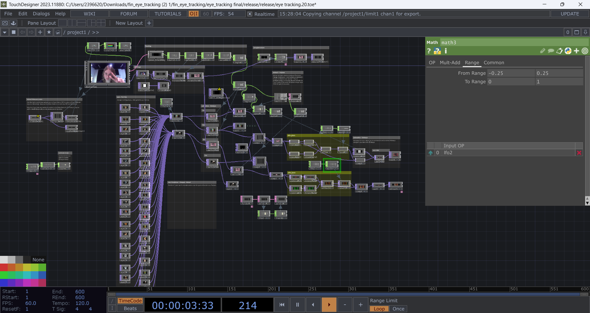
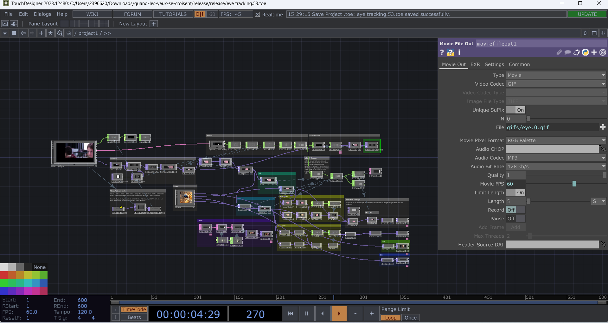
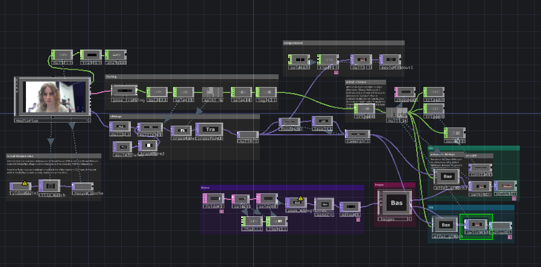
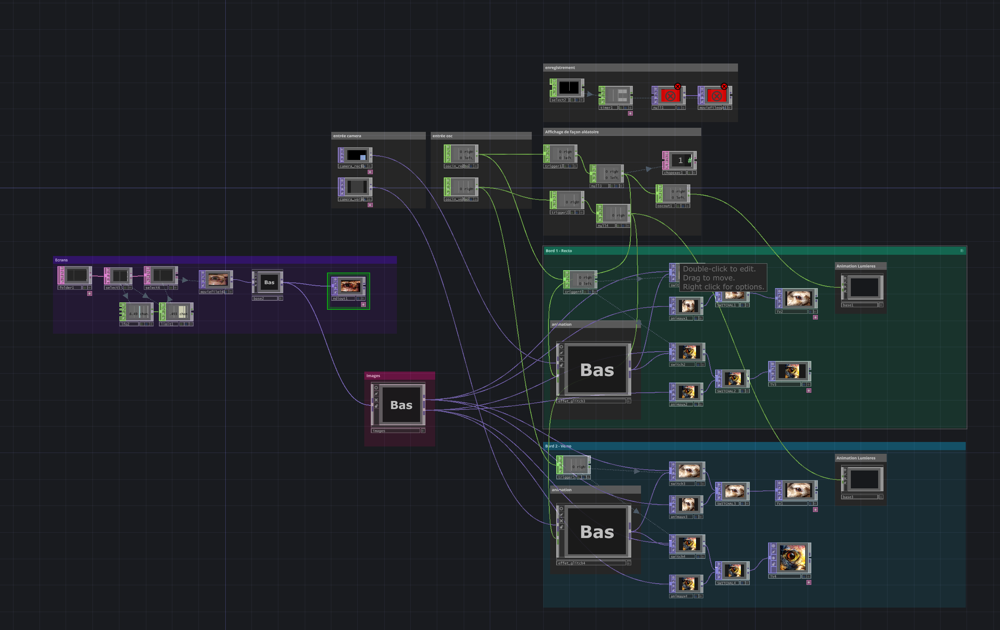
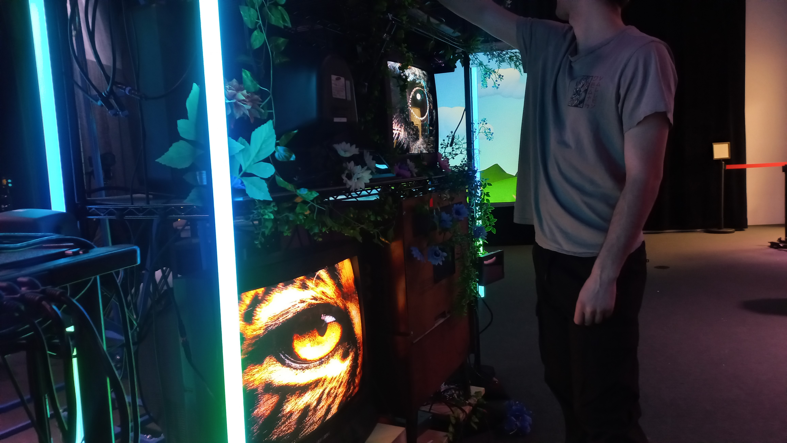
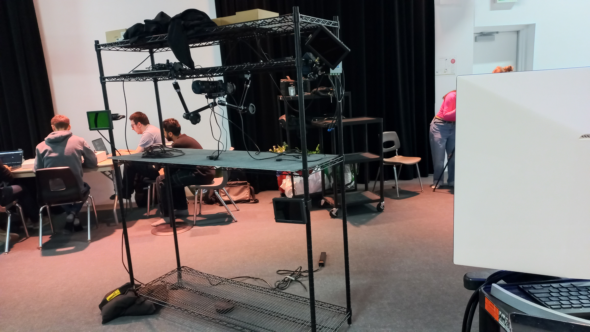
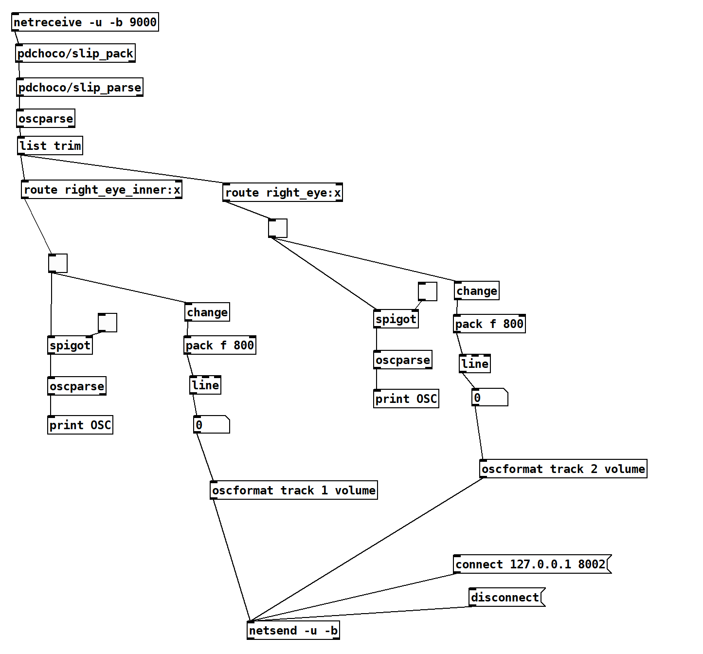
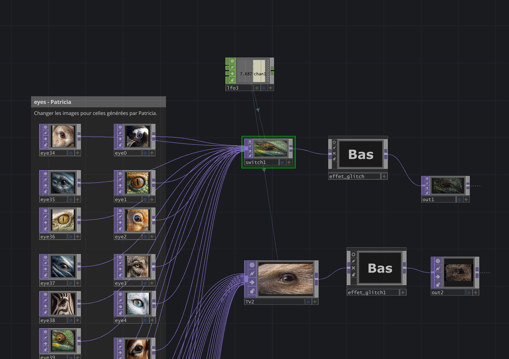
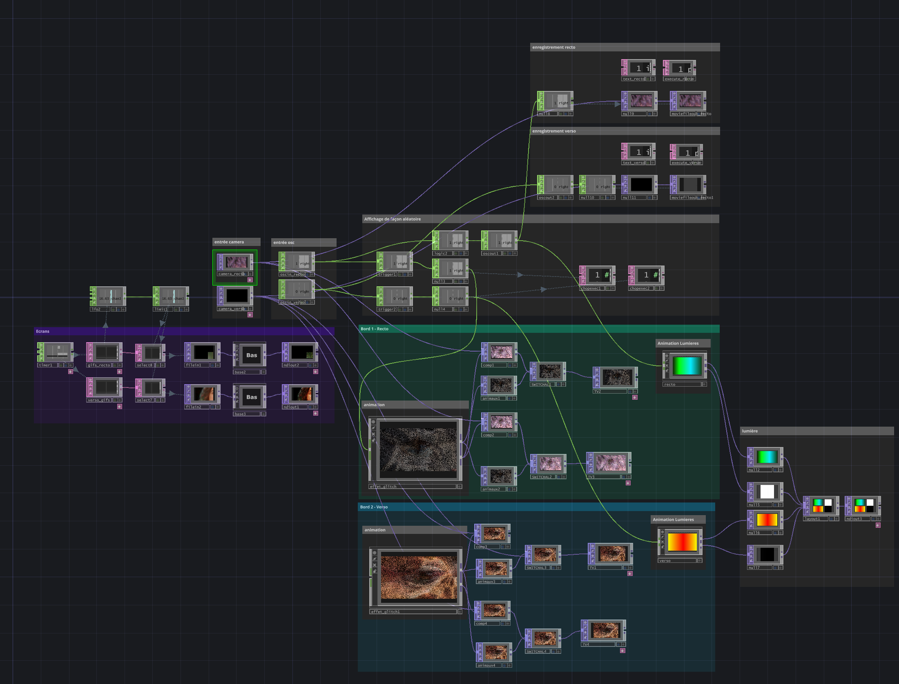

---
---

# Edelwyn Ledru

## Planification

Cette section, complétée lors de la première semaine, présente les tâches individuelles hebdomadaires prévues.

### Semaine 1

- Refaire le plan de plantation 2d

### Semaine 2 - Design et Intégration dans touch

- Faire le logo 
- Faire l'effet d'écran cathodique
- Connecter la captation, l'effet et l'alternation des vidéos

### Semaine 3 - Tournage et tests

- Assemblage de la maquette 1  
  - Faire l'intégration de l'effet morph et glitch dans Touchdesigner
  - Éviter que la captation alterne entre 2 yeux
  - ajouter et connecter l'audio de Manel
- Tournage bande-annonce 
- Tests de l'intégration pour s'assurer que tout fonctionne et resolutions de problèmes au besoin 

### Semaine 4 - Documentation et réglage de bugs

- Prise de photo pour la documentation 
- Faire une transition fluide entre la captation et les regards d'animaux
- Faire powerpoint pour la vidéo 
- Suite du tournage vidéo bande annonce

### Semaine 5 - Preparation de l'installation

- Assemblage de la maquette 2  
  - Pouvoir inclure les yeux des interacteurs dans la séquence vidéo
  - Pouvoir inclure la captation des DEUX caméras dans la séquence vidéo
- Prise de photo pour la documentation 
- Peindre les boîtes 
- Participation au montage vidéo bande-annonce

### Semaine 6 - Installation et documentation

- Prise de photo pour la documentation 
- Installation : boîtes et tissus

### Semaine 6.5

- Résolutions de problèmes au besoin

### Semaine 7

- Archivage : Renommer les médias et les mettre dans le dossier

### Semaine 8

- Présentation

## Journal de bord

Cette section, complétée quotidiennement pendant l’exécution du projet, documente le travail individuel réellement réalisé chaque jour.

### Semaine 2

#### Lundi

Correction planification et compléter le plan plantation 2d

#### Mardi

Création du logo Émersia

#### Mercredi

Intégration dans Touchdesigner :

- Faire le comportement lorsqu'on capte l'oeil, ça change les bâtons LED en blanc
- Regler le format des médias
- S'assurer que la base fonctionne

#### Jeudi

- Paufinage de l'effet de flou sur l'oeil capté

#### Vendredi

### Semaine 3

#### Lundi

#### Mardi

- Paufinage de l'effet glitch
- Optimization du fichier .toe

#### Mercredi

- Connecter TouchDesigner et Reaper via l'osc
- Réglage de bugs :
- L'osc était dans le mauvais channel du à un offset dans pure Data
- Changement de frame sans l'effet glitch
- Ajouter les sons dans reaper

#### Jeudi

- Tentative de reglage de bug :
- Empêchement de mettre l'animation des batons LED sur la capture parce que c'est connecté à la caméra
- Optimization de la sauvegarde des yeux
- Participation au tournage de la bande-annonce

#### Vendredi

- Réunion du comité Design sur le logo
- Participation au creation du logo

### Semaine 4

#### Lundi

- Réunion du comité design : Choix final

#### Mardi

- S'assurer de l'enregistrement dans la séquence
- Régler la pixelisation de l'effet glitch

#### Mercredi

- Remplacement de l'effet glitch par un effet qui se déclenche lors de la detection de l'oeil
- Diviser le projet en 2 projets Touchdesigner (un pour chaque caméra)
- Optimization de la detection : Implementation de limites de distances
- Réglage de bugs : correction des paramètres pour une animation fluide

#### Jeudi

Absente (maladie)

#### Vendredi

### Semaine 5

#### Lundi

#### Mardi

- Connection OSC entre les differents ordis
- petit réglage sur l'effet des yeux d'animaux

#### Mercredi

- Participation au flashing des cartes microSD
- Ajout de l'animation des lumières LED dans le projet touch principal
- Changement de couleur sur les lumières LED quand on capte

#### Jeudi

- Animation des lumières LED en fonction de l'ambiance de base
- Débuggage : correction du bug dans la boucle des yeux enregistrés qui incluait le path
- Ajout d'une animation de lumière LED en blanc pour mieux éclairer

#### Vendredi

### Semaine 6

#### Lundi

- Faire des tests (annulé a cause de la panne du pare-feu du collège)

#### Mardi

- Tests du son (du au manque de temps, on a pas pu les régler) :
- Déclanchement du bruit de détection

#### Mercredi

- participation au deplacement de l'oeuvre et du nouveau branchement
  

#### Jeudi

- Essai d'une nouvelle méthode de detection (sans succès)
- Essai avec des données différentes (sans succès)
- Déclanchement de la bande sonore lors de la detection (réussite)

#### Vendredi

### Semaine 6.5

#### Lundi

- Tests de détection :
- Tests avec une différente donnée + distance entre les yeux (réussite mais un peu lente)

#### Mardi

- Optimisation du son dans pure Data : ajouter une transition
  
- Intégration de l'effet de Jade dans touchDesigner
  

#### Mercredi

#### Jeudi

#### Vendredi

### Semaine 7

#### Lundi

#### Mardi

Dans touchdesigner :

- Intégration du code de Félix pour l'enregistrement des yeux
- Intégration de l'effet particule complet de Jade
- Ajout d'un 2e dossier pour le côté verso de l'installation pour les vidéos de yeux dans la boucle et d'un chronomètre qui rafraichi le folder DAT au chaque 10 secondes

#### Mercredi

Annulation de cours

#### Jeudi

#### Vendredi

### Semaine 8

#### Lundi

#### Mardi

#### Mercredi

#### Jeudi

#### Vendredi
