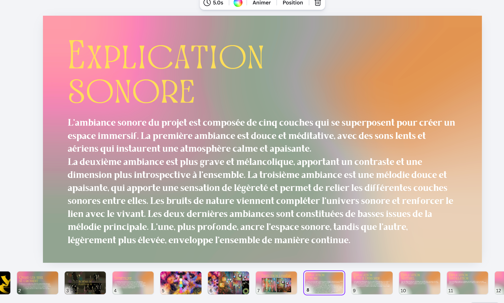
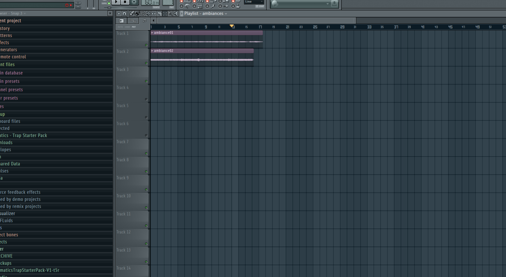
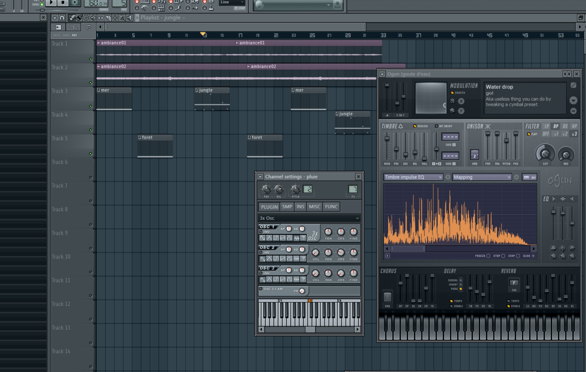
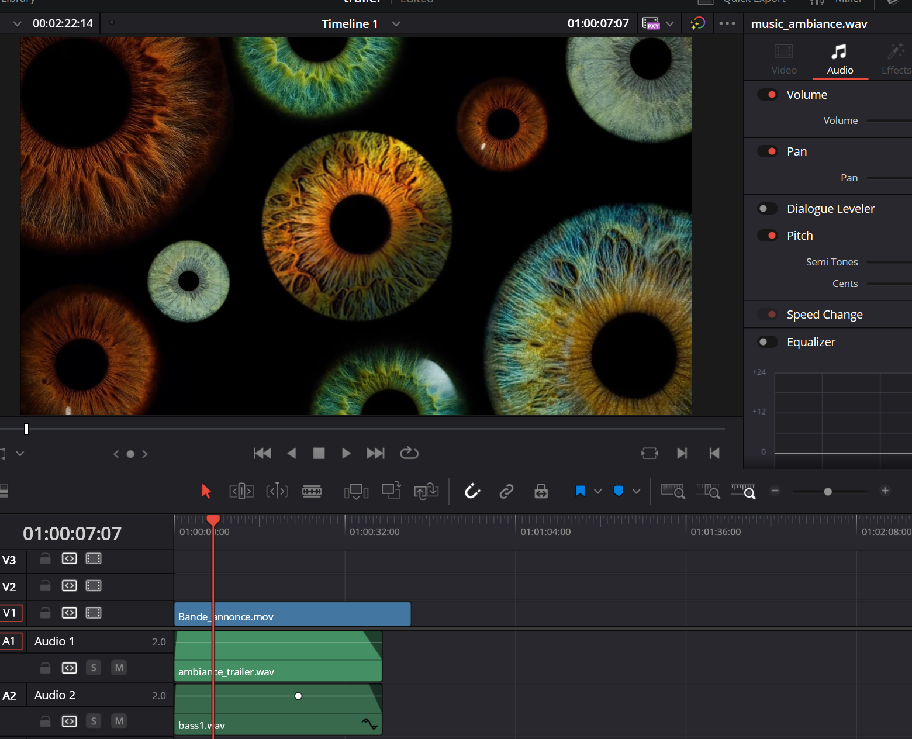
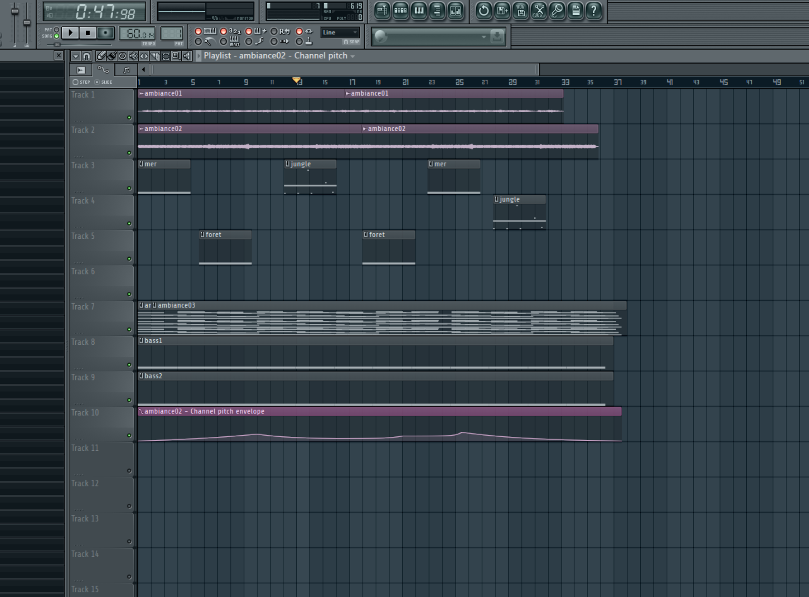
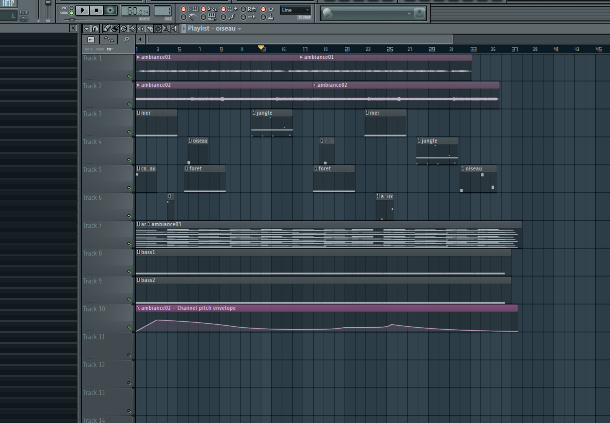
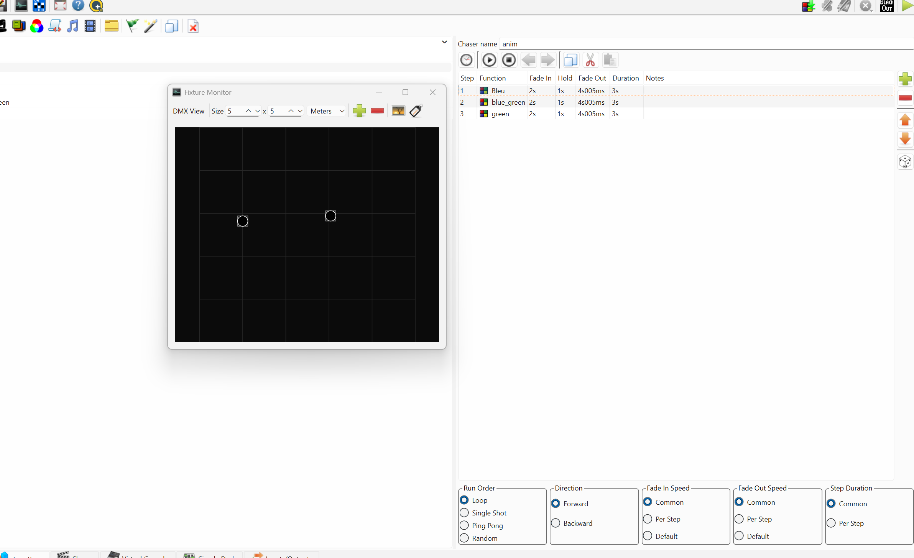
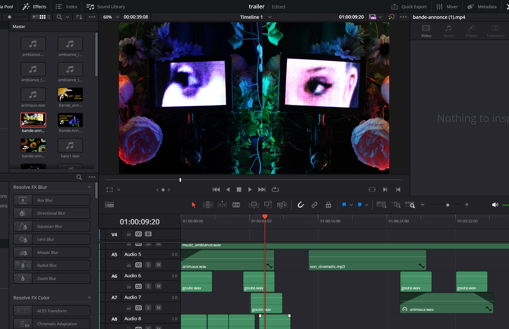

# Manel Yaya

## Planification

Cette section, complétée lors de la première semaine, présente les tâches individuelles hebdomadaires prévues.

### Semaine 1

- Planification des tâches
- Mise à jour du site web
- Organisation de la production

### Semaine 2

- Faire les achats des objets de la direction artistique
- Faire le PowerPoint
- Création des ambiances sonores

### Semaine 3

- Commencer la construction de l’installation :
  - Création des sons interactifs de captation
  - Faire un montage sonore combinant l'ambiance + effets sonores d'environnement

### Semaine 4

- Faire les entrevues
- Ajouter les voix pour les vidéos
- Création des sons d'environnement (vent, mer, feuilles)

### Semaine 5

- Assemblage de la maquette 2
- Création des sons d’animaux
- Tourner la vidéo d'annonce

### Semaine 6

- Montage de la vidéo d'annonce
- Montage de la vidéo finale
- Rassembler les sons pour l’ambiance sonore finale

### Semaine 6.5

- Continuer le montage vidéo
- Direction artistique de l’installation

### Semaine 7

- S’assurer que tout marche
- Faire les finitions

### Semaine 8

- Présenter l’installation

## Journal de bord

Cette section, complétée quotidiennement pendant l’exécution du projet, documente le travail individuel réellement réalisé chaque jour.

### Semaine 2

#### Lundi

Début des recherches pour les objets liés à la direction artistique. Exploration d’idées visuelles et comparaison des prix. Réflexion sur l’ambiance générale du projet.

#### Mardi

Organisation du matériel et planification de leur utilisation dans l’installation.

#### Mercredi

Création des premières ambiances sonores dans FL Studio. Tests de textures sonores douces et expérimentations avec des couches atmosphériques.

#### Jeudi

Début de la création du PowerPoint. Mise en place de la structure, ajout du concept, des intentions artistiques et des premières images de référence.

#### Vendredi

Finalisation de certaines diapositives du PowerPoint. Ajustements mineurs aux ambiances sonores commencées la veille

### Semaine 3

#### Lundi

Rien

#### Mardi

Début de la création des sons interactifs de captation. Expérimentations avec des sons courts et réactifs pour créer une interaction immersive.

 
#### Mercredi

Création des sons d’environnement (vent, mer, feuilles). Superposition des couches sonores pour créer une ambiance naturelle et immersive.

#### Jeudi

Montage sonore combinant l’ambiance principale et les effets sonores d’environnement. Travail sur les transitions et l’équilibre sonore.

#### Vendredi

Réécoute du montage sonore et correction de certains détails pour améliorer la fluidité.

### Semaine 4

#### Lundi

Préparation des questions et organisation pour les entrevues.

#### Mardi

Réalisation des entrevues. Vérification de la qualité audio et vidéo après l’enregistrement.

#### Mercredi

Montage sonore de la bande d'annonce

#### Jeudi

continuation de la bande d'annonce

#### Vendredi

Rien

### Semaine 5

#### Lundi

Assemblage de la maquette 2 , rajout de l'ambiance sonore dans l'installation, changement de l'ambiance trop statique

#### Mardi

Ajout de variations de pitch dans l'ambiance sonore, rajour plus de bruits de natures

#### Mercredi

Ajout d'une deuxieme ambiance sonore pour ameliorer l'interactivite, variation de pitch, rajout de bass

#### Jeudi

changement de l'ambiance sonore de la bande annonce

#### Vendredi

Rien

### Semaine 6

#### Lundi

creation de sons animaux, oiseaux et corbeau

#### Mardi

Creation de sons d'animaux (lion, oiseaux, corbeau)

#### Mercredi

#### Jeudi

#### Vendredi

### Semaine 6.5

#### Lundi
Faire le design de l'affiche du plan de l'ecole pour le comite de deambulation

#### Mardi

Continuation du design de l'affiche du plan d'ecole

#### Mercredi
Creation d'une animation de lumieres pour les lumieres DMX sur QLC+

#### Jeudi

Corrections de la bande sonore de la bande annonce apre les commentaires des eleves

#### Vendredi

Rien

### Semaine 7

#### Lundi

#### Mardi

Test des lumieres DMX, continuation de la bande sonore de la bande annonce

#### Mercredi

#### Jeudi

#### Vendredi

### Semaine 8

#### Lundi
Presentation

#### Mardi

#### Mercredi

#### Jeudi
Montage de la video de documentation finale

#### Vendredi
