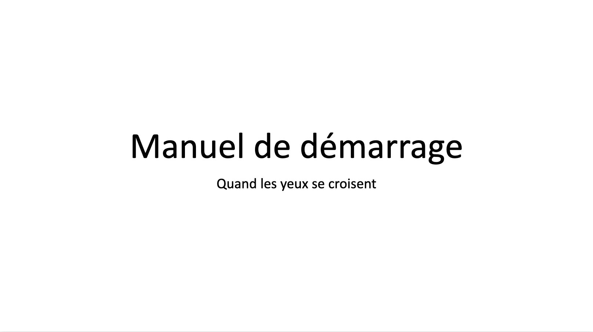

# Exposition

Cette section documente l'exposition publique du projet.

## Permanence

Ce tableau indique les responsables quotidiens de l’exposition, désignés par chaque équipe pour assurer la permanence pendant la semaine.

| Jour     | Heure     | Responsable                                 |
| -------- | --------- | ------------------------------------------- |
| Lundi    | 11h à 20h | Patricia Nassif, Manel Yaya et Félix Lavoie |
| Mardi    | 11h à 21h | Patricia Nassif et Jade Hébert              |
| Mercredi | 11h à 20h | Edelwyn Ledru, Manel Yaya et Félix Lavoie   |
| Jeudi    | 11h à 20h | Jade Hébert, Edelwyn Ledru et Manel Yaya    |
| Vendredi | 11h à 20h | Toutes l'équipe d'Emersia                   |

## Procédure d’ouveture quotidienne

Cette section décrit les étapes nécessaires pour ouvrir l’installation chaque matin. Elle a pour objectif de garantir une mise en place cohérente, sécuritaire et fidèle au projet, quel que soit le responsable de permanence.

## Documentation vidéo finale
